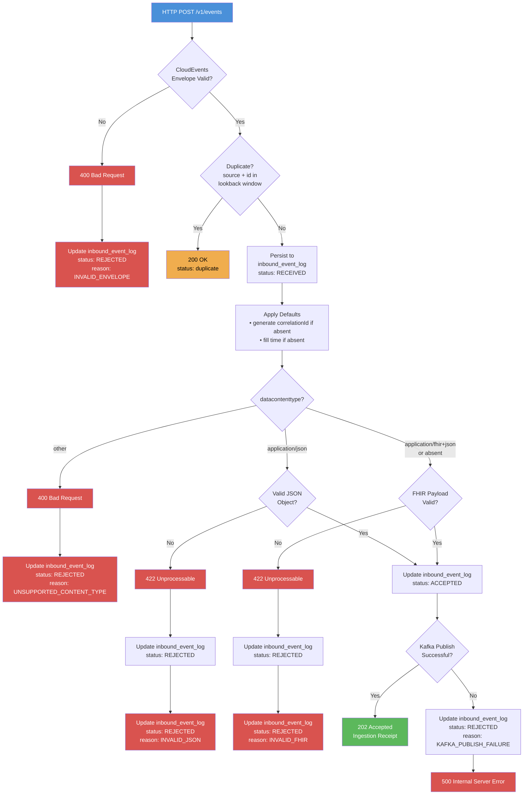
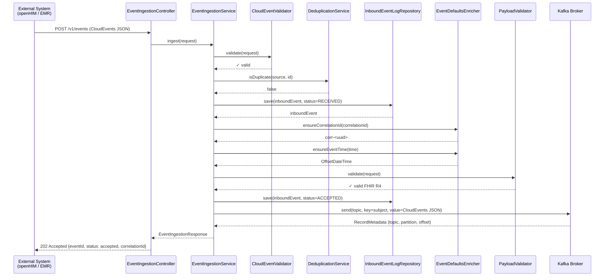
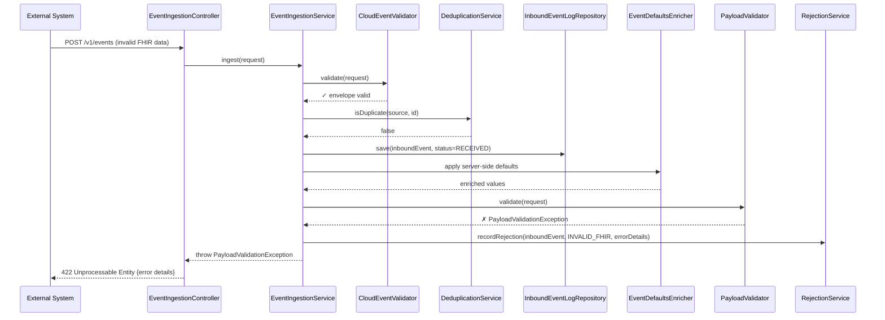
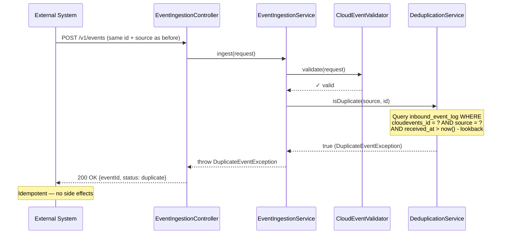
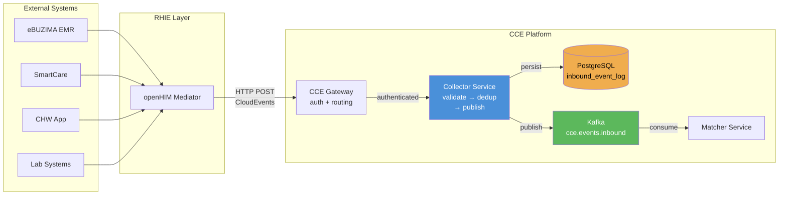
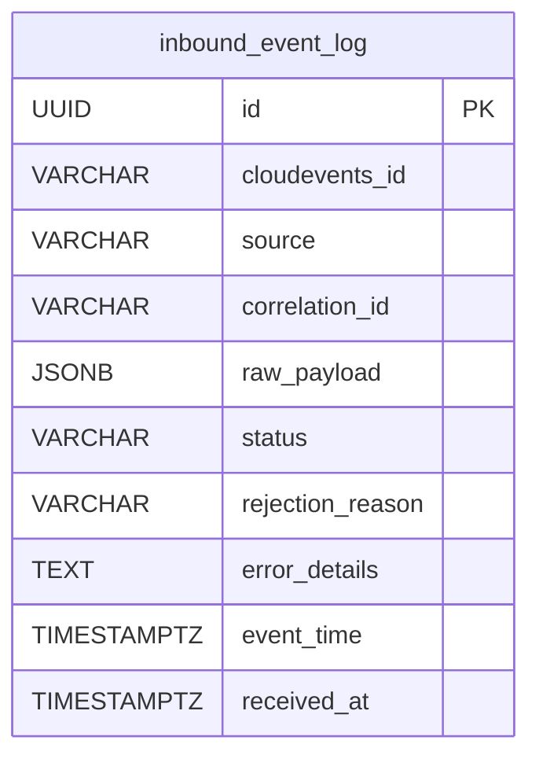
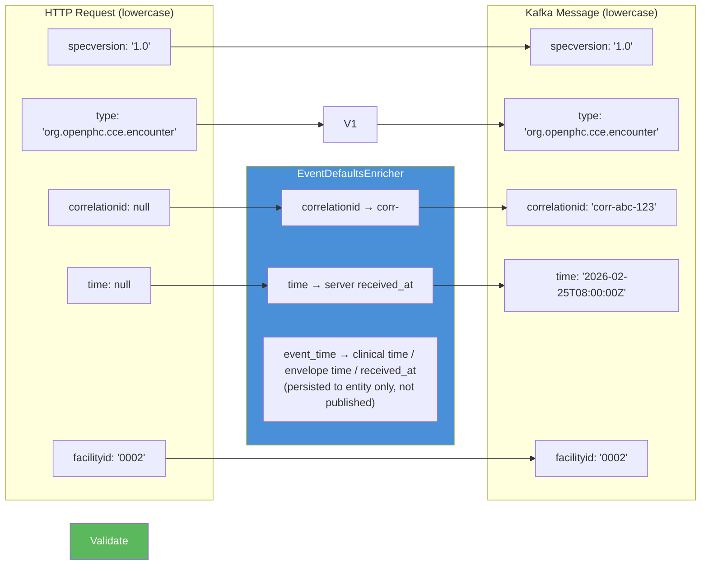

# CCE Collector Service — Flow Diagrams

Visual diagrams of the Collector Service's processing flows using Mermaid.

---

## 1. Event Ingestion Flow (Main Processing Pipeline)

---

## 2. Sequence Diagram — Successful Event Ingestion

---

## 3. Sequence Diagram — Validation Failure (FHIR)

---

## 4. Sequence Diagram — Duplicate Detection

---

## 5. System Context — Data Flow

---

## 6. Database Entity

---

## 7. Field Transformation Pipeline

